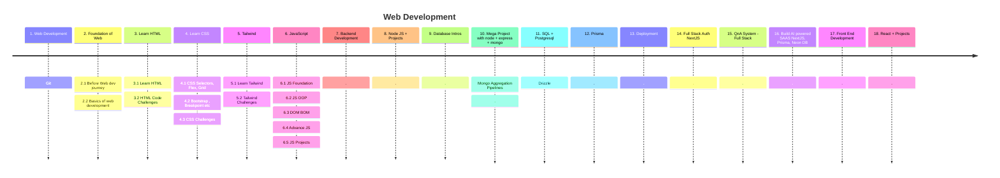

# 🕸️ Web Development

👋 Say, Hi to the Web Development! 
🍁Learn Complete Web Development in most structureed way.

---

### Start the Journey of Web Development

1. Web Development

2. Foundation of Web
   - Section 1. Before Web dev journey
   - Section 2. Basics of web development
      - Client Servers, What's happening behind the scene

3. Learn HTML 
   - Section 3. Learn HTML
   - Section 4. HTML Code Challenges
4. Learn CSS 
   - Section 5. CSS Selectors, Flex, Grid  
   - Bootstrap
   - Breakpoint 
   - CSS Challenges

5. Tailwind 
   - Learn Tailwind 
   - Tailwind Challenges

6. JavaScript 
   - JS Foundation 
   - JS OOP
   - DOM BOM :
   - Advance JS :
   - JS Projects

7. Git

8. Backend Development

9. NodeJS + Projects 
   - How to build your own server like Nginx
   - EventBased things like Event Emitters in NodeJS    

10. Database Intros 

11. Mega Project with node + express + mongo

12. Mongo Aggregation Pipelines
   - After reading this, you won't need anything else. It's complete package.

13. SQL + Postgresql

14. Drizzle 

15. Prisma 

16. Deployment 
    - Once you have built the application, How to deploy the application?

17. Full Stack Auth NextJS 

18. QnA System - Full Stack 

19. Build AI powered SAAS NextJS, Prisma, Neon DB 

20. Front End Development 

21. React + Projects

22. Micro-services Queue System

23. Sockets

24. Docker

---

### 
