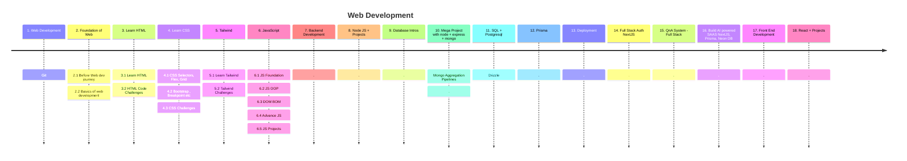

# 🕸️ Web Devlopment

👋 Say, Hi to the Web Development! 
🍁Learn Complete Web Development in most structureed way.

---

### Start the Journey of Web Development

1. Web Development
2. Foundation of Web : 2.1 Before Web dev journey : 2.2 Basics of web development
3. Learn HTML : 3.1 Learn HTML : 3.2 HTML Code Challenges
4. Learn CSS : 4.1 CSS Selectors, Flex, Grid : 4.2  Bootstrap , Breakpoint etc : 4.3 CSS Challenges
5. Tailwind : 5.1 Learn Tailwind : 5.2 Tailwind Challenges
6. JavaScript : 6.1 JS Foundation : 6.2 JS OOP : 6.3 DOM BOM : 6.4 Advance JS : 6.5 JS Projects
7.  Git
8. Backend Development 
10. Database Intros 
11. Mega Project with node + express + mongo : Mongo Aggregation Pipelines
12. SQL + Postgresql : Drizzle 
13. Prisma 
14. Deployment 
15. Full Stack Auth NextJS 
16. QnA System - Full Stack 
17. Build AI powered SAAS NextJS, Prisma, Neon DB 
18. Front End Development 
19. React + Projects
20. Micro-services Queue System
21. Sockets
22. Docker
---
